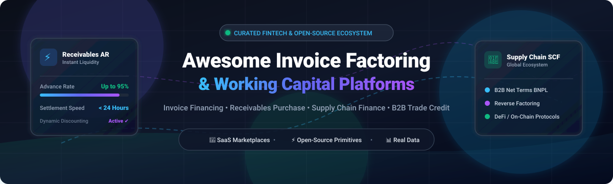

# 💸 Awesome Invoice Factoring & Working Capital Platforms

<p align="center">
  
</p>

<p align="center">
  <a href="https://github.com/ishandutta2007/Awesome-Awesome-Awesome"></a>
  <a href="https://discord.gg/jc4xtF58Ve"></a>
  <a href="https://github.com/ishandutta2007/Awesome-Invoice-Factoring-Platform/stargazers"></a>
  <a href="https://github.com/ishandutta2007/Awesome-Invoice-Factoring-Platform/network/members"></a>
  <a href="https://github.com/ishandutta2007/Awesome-Invoice-Factoring-Platform/blob/main/LICENSE"></a>
  <a href="https://github.com/ishandutta2007/Awesome-Invoice-Factoring-Platform/pulls"></a>
  <a href="https://github.com/ishandutta2007"></a>
</p>

---

## 🌟 Overview & Ecosystem

A **curated collection** of premier **SaaS platforms**, **fintech marketplaces**, and **open-source repositories** for **Invoice Factoring**, **Accounts Receivable (A/R) Financing**, **Supply Chain Finance (SCF)**, **Dynamic Discounting**, **B2B Trade Credit / Net Terms (BNPL)**, and **Working Capital Solutions**.

These platforms empower businesses, suppliers, and enterprise buyers to convert outstanding unpaid invoices into immediate cash flow, reduce Days Sales Outstanding (DSO), eliminate cash flow volatility, and optimize liquidity pipelines across global supply chains.

---

## 📑 Table of Contents

- [🏢 SaaS & Hosted Commercial Platforms](#-saashosted-commercial-platforms)
- [💻 Open-Source GitHub Projects](#-open-source-github-projects)
- [🧩 Key Factoring & Working Capital Concepts](#-key-factoring--working-capital-concepts)
- [🛠️ Architecture Primitives for Building Receivables Systems](#️-architecture-primitives-for-building-receivables-systems)
- [🤝 How to Contribute](#-how-to-contribute)
- [📈 Star History](#-star-history)
- [⚖️ Disclaimer](#️-disclaimer)

---

## 🏢 SaaS/Hosted Commercial Platforms

> 📊 **Market Size & Industry Structure**: The global invoice factoring and receivables financing market is valued between **$3.8 Trillion and $4.5 Trillion** annually and is projected to surpass **$6.0+ Trillion by 2030** (~8.5% CAGR). The sector is **moderately to highly fragmented**: enterprise supply chain finance and dynamic discounting are anchored by deep-network giants (SAP Taulia, C2FO, PrimeRevenue), whereas mid-market and SME invoice factoring is distributed across hundreds of specialized digital balance-sheet lenders, freight factoring platforms, and vertical B2B fintechs.

*Sorted in descending order by estimated company valuation / enterprise scale.*

| Platform | Estimated Scale / Valuation | Category & Core Focus | Starting Pricing | Free Tier / Trial Limits | Description & Key Highlights |
| :--- | :--- | :--- | :--- | :--- | :--- |
| **[Taulia (SAP)](https://taulia.com/)** | **~$200B+ Parent (SAP)**<br>*(~$1B+ Enterprise Value, $500B+ Volume)* | Enterprise Dynamic Discounting & SCF | **0.50% – 1.50% dynamic discount** per 30-day early settlement (buyer or third-party bank funded) | **Free Forever for Suppliers**: $0 supplier portal fee, unlimited PO/invoice tracking, electronic invoicing, and payment scheduling | Native SAP ERP integration, AI-driven cash forecasting, dynamic discounting auction matrix, multi-funder liquidity pools. |
| **[C2FO](https://www.c2fo.com/)** | **~$1.7B – $2.7B Valuation**<br>*(~$107M–$186M Revenue, $500B+ Volume)* | Working Capital Marketplace & Early Payment | **~0.50% – 2.00% APR-equivalent** dynamic discount via *Name Your Rate®* auction mechanism | **Free Forever for Suppliers**: $0 registration, $0 membership fees, unlimited invoice tracking; discount deducted only on accepted early payment offers | Supplier-driven discount bidding, funded directly by enterprise buyers' balance sheets or external partner liquidity. |
| **[Bluevine](https://www.bluevine.com/)** | **~$1.5B+ Valuation**<br>*(~$107M+ Revenue, $767M+ Total Funding)* | Business Line of Credit & Banking | **4.80% simple interest** starting rate (~0.25%/week) on drawn credit lines up to $250,000 | **Free Forever Standard Plan** ($0/mo, unlimited standard ACH & transactions) + **30-Day Free Trial** on Plus/Premier tiers ($30–$95/mo fee waived during trial) | Fast credit approval within 24 hours, revolving credit access against business cashflow, transparent dashboard draw review. |
| **[Fundbox](https://www.fundbox.com/)** | **~$1.1B Unicorn Valuation**<br>*(~$110M+ Revenue, $400M+ Funding)* | Working Capital & Invoice Credit Lines | **4.66% flat fee** per 12-week draw (or 8.99% for 24 weeks) on credit lines up to $250,000 | **Free Forever Account**: $0 sign-up, $0 monthly maintenance fee, soft credit check; zero fees incurred until funds are drawn | Automated sync with accounting software (QuickBooks, FreshBooks), next-day funding, automatic weekly repayments. |
| **[TreviPay](https://www.trevipay.com/)** | **~$400M – $500M Valuation**<br>*(~$281.9M Revenue, $7B+ Volume)* | Global B2B Trade Credit & Payments Network | **~1.50% – 2.50% per transaction** (reported starting base plans from $200/month for small enterprise networks) | **30-Day Sandbox Pilot**: Access to API staging sandbox and test buyer onboarding for 30 days upon sales demo request (no live transactions funded free) | Cross-border trade credit, automated A/R management, buyer credit risk underwriting, multi-currency settlement. |
| **[Drip Capital](https://www.dripcapital.com/)** | **~$350M – $450M Valuation**<br>*(~$60.9M Revenue, $503M Debt & Equity)* | Export & Cross-Border Trade Financing | **0.80% – 1.40% per month** discount rate (~12%–18% APR) + $0 application/origination fees | **Free Forever Registration**: $0 sign-up, soft buyer credit limit check with zero commitment; fees only accrue upon invoice disbursement | Specializes in international exporters and cross-border trade receivables; provides up to 80%–90% upfront cash advances. |
| **[PrimeRevenue](https://www.primerevenue.com/)** | **~$250M – $350M Valuation**<br>*(~$25M–$40M ARR, $300B+ Volume)* | Enterprise Supply Chain Finance (Reverse Factoring) | **SOFR + 0.50% to 1.75% annualized** financing discount on early supplier invoice payouts | **Free Forever for Suppliers**: $0 subscription or platform fees; unlimited invoice status visibility and PO tracking; fees apply only upon early settlement request | Multi-funder bank marketplace, dynamic discounting and reverse factoring for global enterprise supply chains. |
| **[Resolve / Resolve Pay](https://resolvepay.com/)** | **~$100M – $150M Valuation**<br>*(~$10M–$20M ARR, $60M+ Funding)* | B2B Net Terms & Invoice Financing | **3.50% flat transaction fee** per financed invoice ($0 setup fee, $0 monthly subscription) | **Free Forever Portal**: $0/mo tier includes credit underwriting checks, customer payment portal, and standard net terms invoicing without factoring | B2B "Buy Now, Pay Later" (BNPL), non-recourse invoice advances (up to 100% upfront within 1 business day), automates credit decisions. |
| **[FundThrough](https://www.fundthrough.com/)** | **~$50M – $100M Valuation**<br>*(~$8M–$15M ARR, $125M+ Total Facilities)* | On-Demand B2B Invoice Factoring | **1.90% – 2.90% per 30 days** on funded invoices ($0 monthly subscription / maintenance fee) | **Free Forever Account**: $0/mo base access, unlimited accounting software integration (QuickBooks/Xero); requires min. $100,000 outstanding AR to one debtor for initial funding | Selective single-invoice factoring, 100% advance rate minus fee, funds within 24–48 hours without long-term volume contracts. |

---

## 💻 Open-Source GitHub Projects

> 💡 **Open-Source Reality in Factoring**: Commercial invoice factoring requires balance sheet capital, banking licenses, credit underwriting bureaus, and regulatory escrow capabilities. Therefore, open-source projects in this domain typically deliver **smart contract protocols**, **modular ERP/accounting engines**, **A/R workflow systems**, **OCR document extractors**, and **zero-knowledge privacy layers**.

*Sorted in descending order by GitHub star count.*

- **[Odoo Accounting](https://github.com/odoo/odoo)** [](https://github.com/odoo/odoo/stargazers)  
  ⚡ Comprehensive, battle-tested open-source ERP suite featuring robust accounts receivable (A/R), bank reconciliations, payment follow-ups, and extensible payment gateway modules suitable for enterprise factoring workflows.

- **[ERPNext](https://github.com/frappe/erpnext)** [](https://github.com/frappe/erpnext/stargazers)  
  ⚡ 100% open-source Python & JavaScript ERP system with end-to-end accounts receivable tracking, dunning management, automated payment requests, and programmable financial pipeline webhooks.

- **[Akaunting](https://github.com/akaunting/akaunting)** [](https://github.com/akaunting/akaunting/stargazers)  
  ⚡ Free and open-source online accounting software designed for small businesses and freelancers, providing complete invoice lifecycle tracking, cash flow projections, and customer portal capabilities.

- **[Invoice Ninja](https://github.com/invoiceninja/invoiceninja)** [](https://github.com/invoiceninja/invoiceninja/stargazers)  
  ⚡ Leading open-source invoicing, payments, and time-tracking application built with Laravel and Flutter, supporting multi-currency billing, custom payment workflows, and automated client reminders.

- **[Crater](https://github.com/crater-invoice/crater)** [](https://github.com/crater-invoice/crater/stargazers)  
  ⚡ Modern, self-hosted open-source invoicing platform for freelancers and small businesses, featuring clean API architecture and responsive mobile client applications.

- **[Kill Bill](https://github.com/killbill/killbill)** [](https://github.com/killbill/killbill/stargazers)  
  ⚡ Enterprise-grade open-source subscription billing and payment routing engine capable of handling complex multi-tenant A/R settlement architectures.

- **[SolidInvoice](https://github.com/solidinvoice/solidinvoice)** [](https://github.com/solidinvoice/solidinvoice/stargazers)  
  ⚡ Open-source, self-hosted billing solution designed to automate quotes, invoices, and payment tracking for service providers and small enterprises.

- **[Centrifuge Chain](https://github.com/centrifuge/centrifuge-chain)** [](https://github.com/centrifuge/centrifuge-chain/stargazers)  
  ⚡ The decentralized protocol for Real-World Asset (RWA) financing. Enables businesses to tokenize real-world assets (such as invoices, freight bills, and trade receivables) as Non-Fungible Tokens (NFTs) to access DeFi liquidity pools.

- **[Oreko](https://github.com/orekoapp/oreko)** [](https://github.com/orekoapp/oreko/stargazers)  
  ⚡ Clean, modern open-source self-hosted quote and invoice builder serving as a lightweight foundation for receivables tracking.

- **[CashFlowNow](https://github.com/nlankelis/CashFlowNow)** [](https://github.com/nlankelis/CashFlowNow/stargazers)  
  ⚡ Web-based invoice factoring prototype that enables SMEs and freelancers to upload invoices with OCR text extraction, receive factoring offers, and manage receivables status.

- **[Invoice Liquidity Network (ILN)](https://github.com/Invoice-Liquidity-Network/Invoice-Liquidity-Network)** [](https://github.com/Invoice-Liquidity-Network/Invoice-Liquidity-Network/stargazers)  
  ⚡ Decentralized invoice factoring protocol built with Stellar / Soroban smart contracts for on-chain invoice minting, peer-to-peer liquidity provider funding, and escrow settlement.

---

## 🧩 Key Factoring & Working Capital Concepts

| Concept | Explanation |
| :--- | :--- |
| **Traditional Factoring (Spot / Whole Ledger)** | A supplier sells its accounts receivable (invoices) to a third-party factor at a discount (typically 1%–3%) in exchange for immediate cash (80%–95% advance rate). |
| **Recourse vs. Non-Recourse** | In **recourse factoring**, the seller remains liable if the debtor fails to pay. In **non-recourse factoring**, the factor absorbs the credit default risk. |
| **Reverse Factoring (Supply Chain Finance)** | Buyer-initiated financing where suppliers receive early payments from financial institutions at competitive discount rates based on the buyer's investment-grade credit rating. |
| **Dynamic Discounting** | An early payment arrangement where the discount sliding scale is determined dynamically based on how early the buyer settles the supplier's approved invoice. |
| **B2B Buy Now, Pay Later (Net Terms)** | Enables sellers to offer Net 30/60/90 terms at checkout while getting funded upfront with credit underwriting handled programmatically. |

---

## 🛠️ Architecture Primitives for Building Receivables Systems

```
┌─────────────────┐       ┌─────────────────┐       ┌─────────────────┐
│   Invoice OCR   │ ───►  │ Credit Risk Engine│ ───►│  Funding Pool   │
│ (Document AI)   │       │(Underwriting API)│      │(Bank/DeFi Pool) │
└─────────────────┘       └─────────────────┘       └─────────────────┘
         │                         │                         │
         ▼                         ▼                         ▼
┌─────────────────────────────────────────────────────────────────────┐
│              Ledger & Settlement Engine (ERP / Smart Contracts)     │
└─────────────────────────────────────────────────────────────────────┘
```

1. **System of Record**: Open-source ERP engines ([ERPNext](https://github.com/frappe/erpnext), [Odoo](https://github.com/odoo/odoo)) to maintain ledger integrity and invoice metadata.
2. **Ingestion & OCR**: Document capture toolkits extracting line items, debtor tax IDs, and payment terms.
3. **Underwriting & Scoring**: Credit score validation APIs evaluating buyer repayment historical reliability.
4. **Liquidity & Settlement**: On-chain RWA protocols ([Centrifuge](https://github.com/centrifuge/centrifuge-chain), [ILN](https://github.com/Invoice-Liquidity-Network/Invoice-Liquidity-Network)) or direct banking ACH/wire rails.

---

## 🤝 How to Contribute

Contributions are warmly welcome! To add a new platform, tool, or open-source repository:

1. **Fork** the repository.
2. **Create a branch** for your feature: `git checkout -b add-my-platform`
3. **Add your entry** following the tabular or bulleted format with factual pricing, company scale, or repository star badges.
4. **Submit a Pull Request** with a descriptive summary of the addition.

---

## 📈 Star History

[](https://star-history.dera.page/#ishandutta2007/Awesome-Invoice-Factoring-Platform&type=date&legend=top-left)

---

## ⚖️ Disclaimer

- This is an **independent, community-curated directory** for informational, research, and benchmarking purposes only.
- Invoice factoring, lending, and receivables financing are strictly regulated financial activities. Real-world implementations require appropriate financial licenses, legal entity structures, anti-money laundering (AML/KYC) compliance, and accredited capital facilities.
- Mention of specific commercial SaaS products or open-source software does not constitute financial advice or formal endorsement.

---

<p align="center">
  <b>Built with ❤️ for CFOs, Treasury Teams, Fintech Builders, and Working Capital Innovators.</b>
</p>
